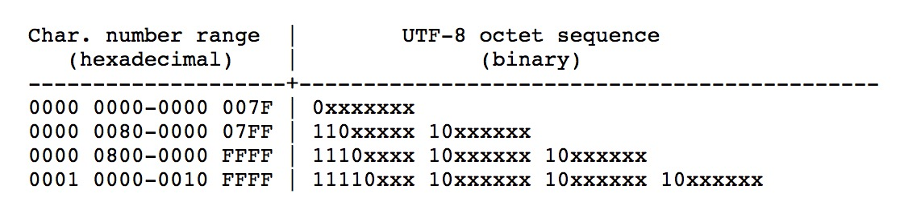

{{ page.title }}
================
## 一、编码发展史

### 1. ASCII

- 1967年推出
- 128字符，7bits
- 33个不可显示，95个可显示

### 2. Latin-1(ISO-8859-1)

- 单字节编码，256个字符
- 兼容ASCII

### 3. unicode(utf-8, utf-16, utf-32)

- 为每一个字符而非字形定义唯一的代码
- 表示方法，U+十六进制数，如“**赞**”->`U+8D5E`

## 二、utf-8

**UTF-8是Unicode的实现方式之一**

### 特点

- 变长编码(1-4个字节)
- 兼容ASCII
- 易于进行网络传输和存储

## 编码规则

1）对于单字节的符号，字节的第一位设为0，后面7位为这个符号的unicode码。因此对于英语字母，UTF-8编码和ASCII码是相同的。

2）对于n字节的符号（n>1），第一个字节的前n位都设为1，第n+1位设为0，后面字节的前两位一律设为10。剩下的没有提及的二进制位，全部为这个符号的unicode码。



如何对一个字符进行utf-8编码？

1. 从上表查出需要的编码字节数
2. 按照上表确定各字节的高位数字
3. 填充“x”位，使用该字符unicode的character number(code point)，规则是从最低位开始，依次往前填充，直到所有的x都被替换为止

### 例子

“赞”->`U+8D5E`->需要3个字节编码->`1110xxxx 10xxxxxx 10xxxxxx`->`11101000 10110101 10011110`->`0xE8B59E`

## 三、Python2中的编码

1. 编码和解码的概念

- 编码(encode)：字符->字节，为了存储和传输
- 解码(decode)：字节->字符，为了显示和阅读

2. Python如何看待字符串

Python字符串分为两种：`str`和`unicode`

```python
In [3]: s1 = '赞'
In [4]: s2 = u'赞'
    
In [5]: s1
Out[5]: '\xe8\xb5\x9e'
In [6]: s2
Out[6]: u'\u8d5e'
    
In [7]: type(s1)
Out[7]: str
In [8]: type(s2)
Out[8]: unicode
```
3. Python解释器如何解析文件

Python interpreter 根据声明的encoding去解析这个文件

```bash
^[ \t\v]*#.*?coding[:=][ \t]*([-_.a-zA-Z0-9]+)
```

```python
#!/usr/bin/python
# -*- coding: latin-1 -*-
import os, sys
...

#!/usr/bin/python
# -*- coding: iso-8859-15 -*-
import os, sys
...

#!/usr/bin/python
# -*- coding: ascii -*-
import os, sys
```
4. 解决方案

- 搞清楚不同的编码

系统环境、网络传输、文件、Python解释器、第三方库

- str本质上是一串二进制数据，unicode是字符

> encoding always takes a Unicode string and returns a bytes sequence, and decoding always takes a bytes sequence and returns a Unicode string”.

- unicode只存在于内部

- 隐式转码问题

  print语句

  读写文件(使用codecs.open)，第三方库chardet.detect

  字符串操作(+、==)

  `sys.setdefaultencoding`的作用范围(慎用)

  ```python
  import sys
  reload(sys)
  sys.setdefaultencoding('utf-8')

  # 三行代码，改变一切
  def welcome_message(byte_string):
      try:
          return u"%s runs your business" % byte_string
      except UnicodeError:
          return u"%s runs your business"%
          unicode(byte_string,encoding=detect_encoding(byte_string))
   
  print(welcome_message(u"Angstrom (Å®)".encode("latin-1"))
  ```

